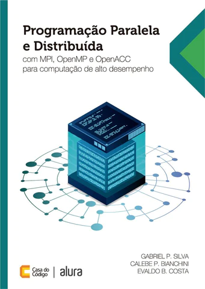

#Programação Paralela e Distribuída

> _"Dar-me-eis um grão de trigo pela primeira casa do tabuleiro; dois pela segunda, quatro pela terceira, oito pela quarta, e, assim dobrando sucessivamente, até a sexagésima quarta e última casa do tabuleiro. Peço-vos, ó rei, de acordo com a vossa magnânima oferta, que autorizeis o pagamento em grãos de trigo, e assim como indiquei!"_ Malba Tahan, O Homem que Calculava.

---

A pesquisa científica moderna, em diversas áreas de conhecimento, tem desenvolvido modelos computacionais sofisticados para solucionar problemas cada vez mais complexos. Esses modelos são transformados em aplicações paralelas que realizam simulações visando obter, no menor prazo possível, aproximações cada vez mais precisas da realidade.

Essas aplicações paralelas são construídas utilizando interfaces de programação e bibliotecas associadas a linguagens de programação convencionais, como **C** e **FORTRAN**, e fazendo uso de plataformas de computação paralela, como _clusters_, sistemas multiprocessadores de memória compartilhada e aceleradores com alto poder computacional para alcançar o desempenho desejado.

A formação de recursos humanos especializados nessa área demanda um longo tempo de investimento e deve ser iniciada o mais cedo possível, já nos primeiros anos dos cursos de graduação, seja nos cursos de Engenharia da Computação, Ciência da Computação ou Engenharia de Software.

O livbro "Programação Paralela e Distribuíd, publicado pela editora Casa do Código, tem como objetivo apresentar conceitos iniciais de programação paralela para alunos de graduação. Aqui, são abordadas as interfaces de programação e bibliotecas MPI, para uso com o paradigma de troca de mensagens, além de OpenMP e OpenACC, para utilização com o paradigma de memória compartilhada e aceleradores.

No repositório [Programação Paralela e Distribuída](https://github.com/Programacao-Paralela-e-Distribuida) estão disponíveis os códigos fontes de todos os exemplos utilizados no livro. Esperamos que sejam úteis para vocês. 

