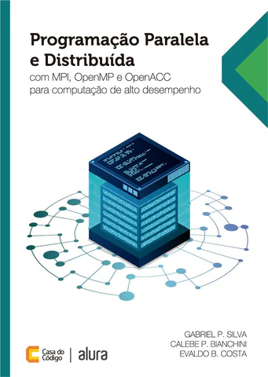
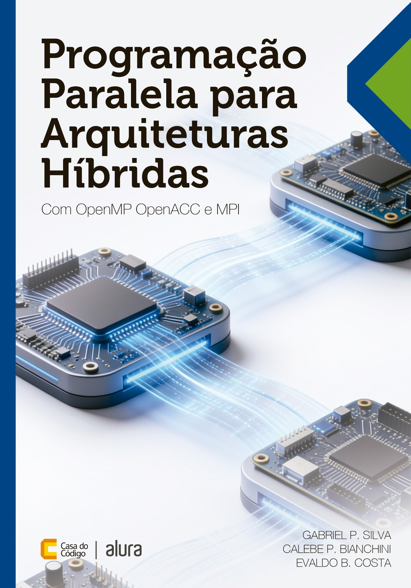

<meta name="description" content="Programação Paralela e Distribuída — Livros e Recursos Educacionais">
<meta name="keywords" content="programação paralela, programação distribuída, linguagem C, OpenMP, MPI, OpenACC, tasks, exemplos, recursos, slides, computação, ensino, brasil, português, ensino de computação, ensino de programação, paralelismo">

# Programação Paralela e Distribuída — Livros e Recursos Educacionais

> _"Dar-me-eis um grão de trigo pela primeira casa do tabuleiro; dois pela segunda, quatro pela terceira, oito pela quarta, e, assim dobrando sucessivamente, até a sexagésima quarta e última casa do tabuleiro. Peço-vos, ó rei, de acordo com a vossa magnânima oferta, que autorizeis o pagamento em grãos de trigo, e assim como indiquei!"_ Malba Tahan, O Homem que Calculava.

---

## Programação Paralela e Distribuída

### Uma trajetória de aprendizagem em dois volumes

Esta coleção apresenta uma trajetória progressiva para o estudo da programação paralela e distribuída, desde os conceitos fundamentais e os principais modelos de programação até o desenvolvimento de aplicações para arquiteturas híbridas e heterogêneas.

O primeiro volume introduz os fundamentos da programação paralela, a avaliação de desempenho e os modelos MPI, OpenMP e OpenACC. O segundo aprofunda esses conhecimentos, abordando arquiteturas paralelas, tarefas, aceleradores, múltiplas GPUs, transferência de processamento e programação híbrida.

Os dois livros são acompanhados por programas em C, exercícios, estudos de caso, slides, notebooks de laboratório e ferramentas interativas. Esses recursos podem ser utilizados em conjunto com os livros ou selecionados individualmente por estudantes, professores e profissionais.

<table align="center" width="80%" cellpadding="100" cellspacing="100">
<tr>
<td width="50%" align="left">
<H3>Programação Paralela e Distribuída com MPI, OpenMP e OpenACC</H3>

O primeiro volume constitui o ponto de entrada da coleção. Apresenta os conceitos fundamentais da programação paralela, as principais métricas de desempenho e três modelos amplamente utilizados na computação de alto desempenho: MPI, para sistemas de memória distribuída; OpenMP, para sistemas de memória compartilhada; e OpenACC, para aceleradores.
 
<B>Indicado para:</B> estudantes de graduação, profissionais que estão iniciando seus estudos em programação paralela e disciplinas introdutórias de computação de alto desempenho.
 
<B>Principais temas:</B> fundamentos da programação paralela, balanceamento de carga, avaliação de desempenho, MPI, OpenMP, OpenACC e ambientes de execução.

</td>
<td  width="50%"  align="center">

</td>
</tr>
</table>

 
 

<table align="center" width="80%" cellpadding="100" cellspacing="100">
<tr>
<td width="50%" align="left">
<H3>Programação Paralela para Arquiteturas Híbridas — Com OpenMP, OpenACC e MPI</H3>

O segundo volume amplia a trajetória iniciada no primeiro livro. Seu foco está na programação de arquiteturas paralelas modernas e heterogêneas, combinando processadores multicore, aceleradores e sistemas distribuídos.

São abordados o modelo de tarefas do OpenMP, a transferência de processamento para aceleradores, recursos avançados do OpenACC, o uso de múltiplas GPUs e a construção de aplicações híbridas com MPI+OpenMP e MPI+OpenACC.
 
<B>Indicado para:</B> leitores que já conhecem os fundamentos da programação paralela ou que desejam estudar tarefas, aceleradores e modelos híbridos com maior profundidade.
 
<B>Principais temas:</B> arquiteturas paralelas, OpenMP Tasks, OpenMP Offloading, OpenACC avançado, múltiplas GPUs, MPI+OpenMP e MPI+OpenACC.

</td>
<td  width="50%"  align="center">

</td>
</tr>
</table>

## Aquisição 

   Os livros acima podem ser adquiridos no formato impresso ou e-book no site da editora [Casa do Código](https://www.casadocodigo.com.br/pages/sumario-programacao-paralela).

<!--
## Apresentação

  
  
Clique aqui para ver mais detalhes

 A pesquisa científica moderna, em diversas áreas de conhecimento, tem desenvolvido modelos computacionais sofisticados para solucionar problemas cada vez mais complexos. Esses modelos são transformados em aplicações paralelas que realizam simulações visando obter, no menor prazo possível, aproximações cada vez mais precisas da realidade. 

Essas aplicações paralelas são construídas utilizando interfaces de programação e bibliotecas associadas a linguagens de programação convencionais, como **C** e **FORTRAN**, e fazendo uso de plataformas de computação paralela, como _clusters_, sistemas multiprocessadores de memória compartilhada e aceleradores com alto poder computacional para alcançar o desempenho desejado. 

A formação de recursos humanos especializados nessa área demanda um longo tempo de investimento e deve ser iniciada o mais cedo possível, já nos primeiros anos dos cursos de graduação, seja nos cursos de Engenharia da Computação, Ciência da Computação ou Engenharia de Software.

O livro "Programação Paralela e Distribuída", publicado pela editora Casa do Código, tem como objetivo apresentar conceitos iniciais de programação paralela para alunos de graduação. Aqui, são abordadas as interfaces de programação e bibliotecas **MPI**, para uso com o paradigma de troca de mensagens, além de **OpenMP** e **OpenACC**, para utilização com o paradigma de memória compartilhada e aceleradores.

O **MPI** é uma das interfaces de programação paralela mais utilizadas na computação científica, podendo ser empregada desde os equipamentos mais simples, com apenas algumas dezenas de processadores, até os clusters de alto desempenho, com dezenas de milhares de processadores. O **OpenMP** e o **OpenACC**, por suas vezes, são padrões para programação de sistemas multiprocessadores com memória compartilhada e aceleradores como GPUs e processadores manycores, caracterizados pela sua extrema facilidade de uso e relativo baixo custo.

Este livro está organizado da seguinte maneira: primeiramente são apresentados conceitos gerais de programação paralela, os diversos paradigmas de programação e formas de desenvolvimento de um programa paralelo, com considerações sobre balanceamento de carga e as métricas de avaliação de desempenho, comuns a qualquer tipo de programa paralelo.

No capítulo seguinte as funções básicas para o envio e recepção de mensagens do **MPI** são introduzidas. Logo após, as funções de comunicação coletiva, de grande importância para o trabalho cooperativo entre processos, são descritas. Em seguida, são apresentados detalhes sobre os diversos modos disponíveis no **MPI** para o envio e recepção de mensagens. No capítulo sobre o **OpenMP**, as diversas diretivas e suas respectivas cláusulas que são utilizadas para explorar o paralelismo embutido nos laços computacionais são apresentadas, junto das primitivas de sincronização disponíveis na linguagem, essenciais no paradigma de memória compartilhada.

No último capítulo, as diretivas e cláusulas do **OpenACC** são discutidos. O **OpenACC** é compatível com os modelos de programação **OpenMP** e **MPI**, ambas as abordagens podem ser combinadas com o **OpenACC**. O **OpenACC** é um modelo de programação aberta para computação paralela desenvolvido com o objetivo de simplificar a programação paralela, oferecendo alto desempenho e portabilidade entre diversos tipos de arquiteturas: multicore, manycore e GPUs.

O livro inclui também apêndices com detalhes dos ambientes de execução do **MPI**, **OpenMP** e **OpenACC**. São discutidas as diferenças entre os diversos pacotes e compiladores disponíveis, além das opções de compilação e outros detalhes para extrair o máximo desempenho das aplicações.

Ao longo deste livro são apresentados exemplos simples e objetivos para o uso de cada uma das funções, diretivas e cláusulas dos diversos paradigmas, bibliotecas e interfaces de programação abordados. Todos os exemplos foram cuidadosamente elaborados, compilados e testados em ambientes paralelos, de modo que possam ser baixados, compilados e reproduzidos facilmente em qualquer equipamento onde um mínimo de paralelismo esteja disponível. Estudos de caso e exercícios propostos podem ser encontrados ao final de cada capítulo, como forma de fixação e complemento dos conceitos elencados na parte teórica.

No repositório [Programação Paralela e Distribuída](https://github.com/Programacao-Paralela-e-Distribuida) estão disponíveis os códigos fontes de todos os exemplos utilizados no livro, que pode ser adquirido direto do site da editora [Casa do Código](https://www.casadocodigo.com.br/pages/sumario-programacao-paralela).

Esperamos que este livro possa ser um guia seguro para os passos iniciais das pessoas interessadas no uso da programação paralela de uma forma eficiente e produtiva.

## Conteúdo

  
  
Clique aqui para ver mais detalhes

  
 O Livro está organizado da seguinte maneira:

1. **Introdução**
   - Exemplos de aplicações paralelas
   - MPI
   - OpenMP
   - OpenACC
2. **Conceitos básicos**
   - Processos e Threads
   - Programação paralela
   - Balanceamento de carga
   - Avaliação de desempenho
   - Arquiteturas paralelas
   - Exercícios propostos
3. **Comunicação ponto a ponto no MPI**
   - Introdução
   - Comunicadores
   - Exemplo de um programa em MPI
   - Funções de gerenciamento do ambiente
   - Envio e recepção de mensagens
   - Identificando as mensagens recebidas
   - Algumas recomendações
   - <a href="https://github.com/Programacao-Paralela-e-Distribuida/MPI">Estudo de caso: método do trapézio</a>
   - Exercícios propostos
4. **Comunicação coletiva no MPI**
   - Barreira
   - Difusão
   - Distribuição
   - Coleta
   - Redução
   - Redução com difusão
   - Coleta com difusão
   - Transposição
   - Algumas observações
   - <a href="https://github.com/Programacao-Paralela-e-Distribuida/MPI">Estudo de caso: multiplicação de matriz por vetor</a>
   - Exercícios propostos
5. **Comunicação MPI em detalhes**
   - Introdução
   - Rotinas de envio e recepção bloqueantes
   - Rotinas de envio e recepção não bloqueantes
   - Esperando a mensagem
   - Modos de comunicação
   - Evitando o impasse ou deadlock
   - Considerações de desempenho
   - <a href="https://github.com/Programacao-Paralela-e-Distribuida/MPI">Estudo de caso: números primos</a>
   - Exercícios propostos
6. **OpenMP**
   - Introdução
   - Diretivas principais
   - Funções OPENMP
   - Cláusulas
   - Sincronização
   - Variáveis de ambiente
   - Erros comuns e recomendações
   - <a href="https://github.com/Programacao-Paralela-e-Distribuida/OPENMP">Estudos de caso</a>
   - Exercícios
7. **OpenACC**
   - Modelo de programação OpenACC
   - Diretivas principais
   - Movimentação de dados
   - Cláusulas das diretivas parallel
   - Cláusulas da diretiva loop
   - Diretivas avançadas
   - Funções OpenACC
   - Variáveis de ambiente
   - Erros comuns e recomendações
   - <a href="https://github.com/Programacao-Paralela-e-Distribuida/OPENACC">Estudos de caso</a>
   - Exercícios
8. **Ambientes de execução**
   - <a href="https://programacao-paralela-e-distribuida.github.io/MPI/docs/MIP-2024.pdf">Preparação do ambiente de execução MPI</a>
   - <a href="https://github.com/Programacao-Paralela-e-Distribuida/OPENMP">Preparação do ambiente de execução OpenMP</a>
   - <a href="https://github.com/Programacao-Paralela-e-Distribuida/OPENACC">Preparação do ambiente de execução OpenACC</a>
   

-->
<h2 id="recursos">Repositórios</h2>
<ul>
<li>
<b><a href="https://github.com/Programacao-Paralela-e-Distribuida/MPI"> Repositório com códigos fonte em MPI para o Livro 1.</a></b>
</li>
<li>
<b><a href="https://github.com/Programacao-Paralela-e-Distribuida/OPENMP"> Repositório com códigos fonte em OpenMP para os Livros 1 e 2.</a></b>
</li>
<li>
<b><a href="https://github.com/Programacao-Paralela-e-Distribuida/OPENACC"> Repositório com códigos fonte em OpenACC para os Livros 1 e 2.</a></b>
</li>
<li>
<b><a href="https://github.com/Programacao-Paralela-e-Distribuida/HIBRIDA"> Repositório com códigos fonte em MPI+X para o Livro 2.</a></b>
</li>
<li>
<b><a href="https://github.com/Programacao-Paralela-e-Distribuida/SERIAL"> Repositório com códigos fonte sequenciais para os Livros 1 e 2.</a></b>
</li>
</ul>
<h2 id="recursos">Slides</h2>

Alguns slides de apoio para os professores estão disponíveis a seguir. 

<ul>
<li>  Livro 1 - MPI, OpenMP e OpenACC</li>
<ul>
<li><a href="slides/MPI.pdf">MPI</a></li>
<li><a href="slides/OpenMP.pdf">OpenMP</a></li>
<li><a href="slides/OpenACC.pdf">OpenACC</a></li>
</ul>
<li>  Livro 2 - OpenMP Tasks, OpenMP offloading e Programação Híbrida</li>
<ul>
<li><a href="slides/OpenMPTasks.pdf">OpenMP Tasks</a></li>
<li><a href="slides/Hibrida.pdf">Programação Hibrida</a></li>
</ul>
</ul>

<h2 id="recursos">Ferramentas de Visualização</h2>

 Colocamos disponíveis algumas ferramentas de visualização, disponíveis em português, espanhol e inglês, para auxiliar no entendimento do funcionamento da distribuição de dados e carga de trabalho entre processos/<em>threads</em> de uma aplicação MPI ou OpenMP.

<ul>
<li>  Livro 1 - MPI, OpenMP e OpenACC</li>
<ul>
<li><a href="./interactive-tools/calcpi2.html">Cálculo de Pi com MPI</a></li>
<li><a href="./interactive-tools/primos2.html">Cálculo de primos com MPI</a></li>
<li><a href="./interactive-tools/mxv2.html">Multiplicação de Matriz por Vetor com MPI</a></li>
<li><a href="./interactive-tools/simulador-openmp.html">Escalonamento das iterações de um laço em OpenMP</a></li>
<li><a href="./interactive-tools/simulador-openmp-collapse-tile.html">Funcionamento da cláusula <b>collapse</b> no OpenMP</a></li>
<li><a href="./interactive-tools/simulador-openacc-collapse-tile.html">Funcionamento da cláusula <b>collapse</b> no OpenACC</a></li>
</ul>
</ul>

<!-- Google tag (gtag.js) -->

